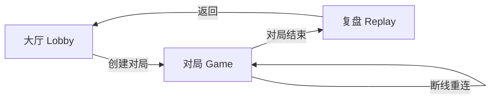

# 十人狼人杀 · 前端设计规范

> PM 交付物 · 注册类型：**product**（对局工具 UI）  
> 视觉注册延伸：**Committed** 暗色策略，月蚀红为唯一高饱和强调色

---

## 1. 设计目标与氛围

### 目标
- 让玩家在 **10 人预女猎守** 对局中快速掌握：当前阶段、谁在发言、自己能做什么、公屏发生了什么。
- 夜间营造 **压低声音、屏息凝神** 的压迫感；白天切换为略亮的「议事」氛围，信息层级仍清晰。
- 避免通用 SaaS / AI 审美：不用 Inter、不用紫渐变、不用玻璃拟态堆砌、不用左侧色条卡片。

### 场景句（决定暗色主题）
> 玩家深夜在卧室台灯下，笔记本屏幕是唯一光源，需要盯紧 10 人座位与公屏日志，偶尔在倒计时结束前完成发言或投票。

因此默认 **深色底 + 暖琥珀点缀 + 血红强调**，不用纯白背景。

### 情绪关键词
`月蚀` · `议事厅` · `紧张` · `可读` · `仪式感`

---

## 2. 用户旅程



| 阶段 | 用户心智 | 界面职责 |
|------|----------|----------|
| 大厅 | 「我要开一局」 | 沉浸式入口、昵称、规则一瞥、开始 |
| 对局 | 「现在轮到谁？我该干嘛？」 | 座位环 + 阶段条 + 公屏 + 操作区 + 私域 |
| 复盘 | 「刚才发生了什么？AI 怎么想的？」 | 三级 Tab，结构就绪，数据可后接 API |

---

## 3. 页面 Wireframe（文字）

### 3.1 大厅 `/`

```
┌─────────────────────────────────────────────┐
│  [品牌标] 月蚀议事厅 · 十人预女猎守          │
│                                             │
│     ╭─────────────────────────────╮         │
│     │  满月装饰 / 星轨背景纹理      │         │
│     │  标题（衬线）                 │         │
│     │  副标题：1 人 + 9 AI          │         │
│     │  [昵称输入]                   │         │
│     │  [开始新局 · 主按钮]          │         │
│     │  ▼ 规则简述（折叠）           │         │
│     ╰─────────────────────────────╯         │
└─────────────────────────────────────────────┘
```

### 3.2 对局 `/game/:gameId`

```
┌──────────────────────────────────────────────────────────┐
│ 顶栏：对局 ID · 你的座位/身份 · WS 连接状态               │
├──────────────────────────────────────────────────────────┤
│ 阶段条：[夜晚|白天] [子阶段] [第 N 夜/日] · 倒计时(可选)  │
├────────────────────────────┬─────────────────────────────┤
│                            │                             │
│      10 人座位圆环         │   公屏日志（时间线）         │
│   存活/死亡/发言高亮       │   系统/发言/投票/死讯        │
│                            │                             │
├────────────────────────────┴─────────────────────────────┤
│ 操作坞：发言 | 投票 | 夜晚技能（私域面板，仅请求时出现）  │
│ 死后：操作坞置灰 + 「观战模式」提示，公屏与座位仍可见      │
└──────────────────────────────────────────────────────────┘
```

### 3.3 复盘 `/replay/:gameId`

```
┌─────────────────────────────────────────────┐
│ 标题 + 对局 ID                               │
│ [时间线] [玩家视角] [AI 思考链]  ← Tabs      │
├─────────────────────────────────────────────┤
│ Tab 内容区（占位数据 + 精美空态/示例）       │
│ 结构对齐未来 replay API                      │
└─────────────────────────────────────────────┘
```

---

## 4. 色彩 / 字体 / 间距系统

### 4.1 色彩（OKLCH，CSS 变量）

| Token | 用途 | 近似语义 |
|-------|------|----------|
| `--bg-deep` | 页面底 | 深蓝黑，非纯黑 |
| `--bg-elevated` | 面板 | 略亮一层 |
| `--bg-night` | 夜晚阶段覆盖 | 更冷、更低明度 |
| `--bg-day` | 白天阶段覆盖 | 略暖、略亮 |
| `--text-primary` | 正文 | 雾白（带蓝调） |
| `--text-muted` | 次要 | 灰蓝 |
| `--accent-blood` | 主强调、倒计时、危险 | 月蚀红 |
| `--accent-amber` | 发言轮到你、人类标记 | 烛火琥珀 |
| `--accent-moon` | 链接、信息 | 银月 |
| `--role-wolf` | 狼人相关（私域） | 暗红 |
| `--role-good` | 好人技能提示 | 松绿 |
| `--success` / `--warning` / `--error` | 连接、Toast | 语义色 |

策略：**Committed** — 暗色面占 70%+，血红强调 ≤ 15% 面积，琥珀用于「你的回合」。

### 4.2 字体

详见 `frontend/docs/typography.md`。

| 层级 | 字体 | 用途 |
|------|------|------|
| Display | `ZCOOL XiaoWei` | 品牌、过场、阶段、结算、座位强调 |
| Body | `Noto Sans SC` | 公屏、按钮、表单、说明 |
| Mono | `JetBrains Mono` | 局号、倒计时、复盘时间 |

字号阶梯（rem）：`0.75 / 0.875 / 1 / 1.125 / 1.5 / 2 / 2.5`

### 4.3 间距

基础单位 **4px**。常用：`4 8 12 16 24 32 48`。  
对局页外边距桌面 `24px`，平板 `16px`。圆环直径 `min(72vw, 420px)`。

---

## 5. 组件库选型

**选用：Tailwind CSS v3 + 自研轻量 UI 组件**

| 考量 | 结论 |
|------|------|
| Ant Design | 表格/表单强，但默认企业风，难做「议事厅」沉浸感 |
| shadcn/ui | 定制力强，但需大量 CLI 初始化与 Radix 依赖 |
| **Tailwind + 自定义** | 与 Vite+React+TS 零摩擦；圆环座位、阶段氛围、私域面板均可像素级控制；符合 impeccable「鲜明风格」 |

依赖：`tailwindcss`、`clsx`、`tailwind-merge`、`lucide-react`（图标一致性）。

---

## 6. 关键交互

| 交互 | 行为 |
|------|------|
| 发言倒计时 | `SPEAK_TURN_START` 显示环形或数字倒计时；≤10s 时 accent 脉冲（CSS，无 layout 动画） |
| 投票 | 存活且 `voteActive` 时，座位环可点选 + 底部确认条；支持弃票 |
| 夜晚私域 | `nightAction` 时右侧滑入/底部展开私域面板，狼/验/巫/守分文案 |
| 死后观战 | `!is_alive` 禁用操作坞，顶部 Banner「观战模式」 |
| 公屏日志 | 时间线：左轴圆点 + 类型色点；新消息自动滚底 |
| 连接状态 | 顶栏 Badge：连接中/已连接/重连/错误 |
| Toast | 错误、重连提示（轻量，非 Modal） |

WebSocket / `gameStore` / `useGameWebSocket` **接口不变**，仅 UI 消费现有 state。

---

## 7. 响应式

- **桌面优先**（≥1024px）：圆环左 + 日志右 + 操作坞底栏全宽。
- **平板**（768–1023px）：圆环缩小，日志下移为全宽。
- **小屏**（<768px）：圆环改为 2×5 网格座位图，日志与操作栈叠。

---

## 8. 无障碍（basics）

- 语义化：`<main>`、`<nav>`、`aria-live="polite"` 于公屏新消息区。
- 焦点可见：`focus-visible` 2px 琥珀描边。
- 对比：正文与背景 WCAG AA；强调按钮 AA+。
- Reduced motion：`prefers-reduced-motion` 关闭脉冲动画。
- 表单：`label` 关联 `input`，按钮 `disabled` + `aria-busy` 于加载态。

---

## 9. 反模式（本项目禁止）

- 左侧 4px 色条卡片
- 渐变文字标题
- 全屏 Modal 代替 inline 操作
- 10 张相同 icon+标题 卡片墙
- 紫色 / 霓虹 crypto 风

---

## 10. 实现清单（开发对照）

- [x] `DESIGN.md`（本文）
- [ ] Tailwind + tokens + `index.css`
- [ ] `LobbyPage` 沉浸入口
- [ ] `GamePage` 圆环 + 阶段条 + 日志 + 操作坞
- [ ] `ReplayPage` 三级 Tab + 占位
- [ ] `App` 布局 / 404 / Loading·Error
- [ ] `frontend/README.md` 更新
