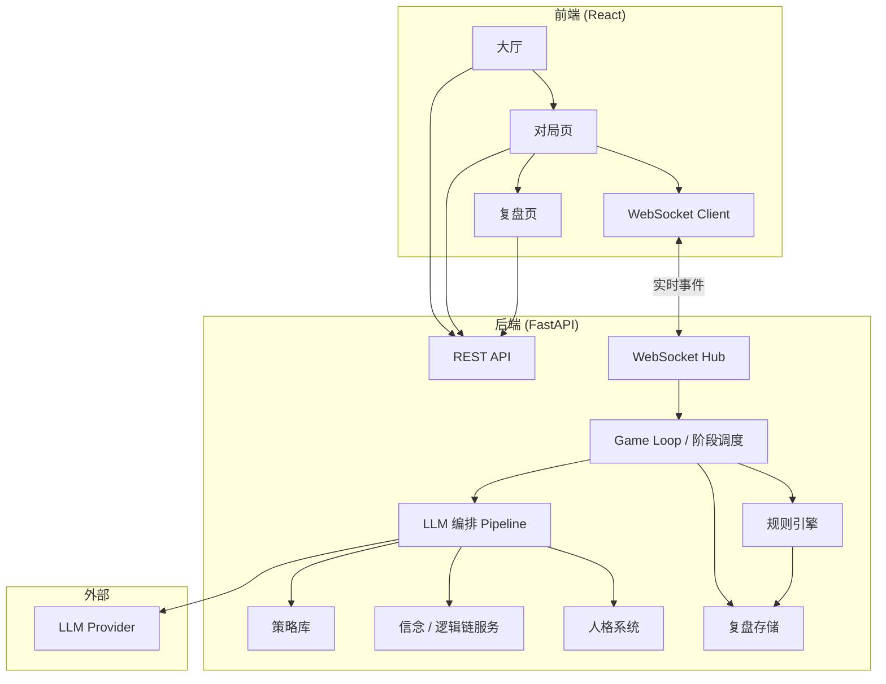
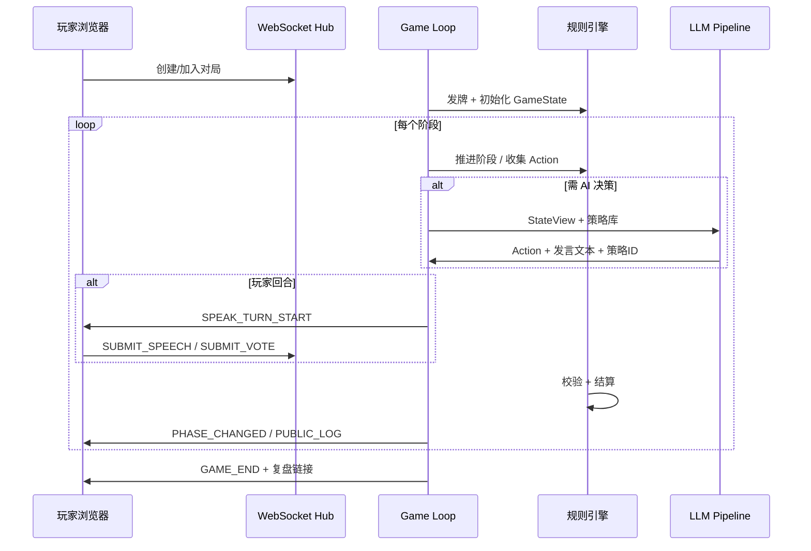
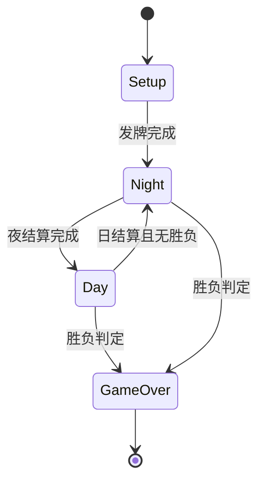
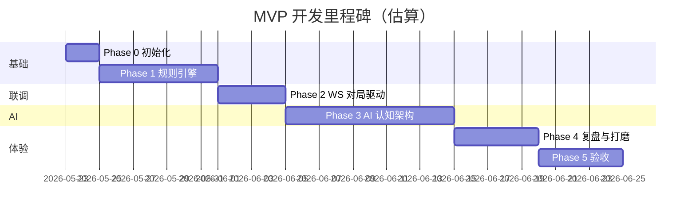

# 十人狼人杀 MVP — 开发流程

> 基于 [`最小mvp.md`](./最小mvp.md) 编写，供策划 / 程序 / 内容团队直接开工。  
> 板子：预女猎守 · 无警长 · 10 人固定（1 人 + 9 AI）  
> MVP 目标：**打完一局觉得能玩下去**，约 **30 分钟 / 局**。

---

## 1. 项目概述与技术选型

### 1.1 产品概述

| 维度 | 约定 |
|------|------|
| 核心爽点 | 看 AI 互撕；玩家是局中一员，靠合法信息推理 |
| 板子 | 预女猎守，无警长，10 人固定 |
| 节奏 | 约 30 分钟 / 局，2～3 个完整「夜—日」循环 |
| AI 底线 | 9 个里最多 3 个可偏「傻」；其余需有基本逻辑与一致性 |
| 不在 MVP | 语音实装、白天插话、警长流、玩家影响狼刀 |

### 1.2 技术栈

| 层级 | 选型 | 理由 |
|------|------|------|
| 前端框架 | **Vite + React 18 + TypeScript** | 冷启动快、HMR 体验好；TS 约束 GameState 与 WebSocket 事件类型，减少前后端联调错误 |
| 前端路由 | **React Router v6** | 大厅 / 对局 / 复盘三页清晰分离；后续可加嵌套路由（死后观战 overlay） |
| 前端状态 | **Zustand** | 比 Redux 轻量，适合单局 GameState 订阅；WebSocket 推送可直接 patch store |
| UI 样式 | **Tailwind CSS** | 快速搭建公屏时间线、投票面板、复盘三级视图，无需引入重型组件库 |
| 后端框架 | **FastAPI (Python 3.11+)** | 异步原生支持 WebSocket；Pydantic 模型与前端 TS 类型可镜像；AI/规则引擎同语言便于集成 |
| 实时通信 | **WebSocket（FastAPI）** | 对局阶段推送、发言倒计时、投票结果需低延迟；REST 仅用于非实时操作（创建局、拉复盘） |
| 规则引擎 | **纯 Python 模块（`backend/app/game/`）** | 与 LLM 解耦；可单元测试覆盖全部状态转换；AI 只能通过合法 Action API 影响局面 |
| LLM 集成 | **OpenAI 兼容 API（默认 OpenAI / 可换 DeepSeek 等）** | 统一 `chat/completions` 接口；通过环境变量切换 provider；MVP 不做多模型路由 |
| LLM 编排 | **自研 Pipeline（策略选 → 行动 → 发言）** | 需求明确要求「先过策略库」；Pipeline 每步注入结构化 context，便于复盘追溯 |
| 持久化 | **MVP：内存 + JSON 文件落盘** | 单局复盘需完整日志；MVP 无需 Redis/DB；局结束后写 `data/replays/{game_id}.json` |
| 任务队列 | **asyncio 内置（MVP 不用 Celery）** | 单局串行阶段推进；AI 并发仅在「夜晚私域 LLM 调用」用 `asyncio.gather` |
| 测试 | **pytest（后端）+ Vitest（前端）** | 规则引擎必须高覆盖率；前端测关键 UI 状态渲染 |
| 包管理 | **pnpm（前端）+ uv/pip（后端）** | pnpm 节省磁盘；后端 `pyproject.toml` 统一依赖 |

### 1.3 非功能需求

- **信息隔离**：规则引擎是「真相源」；AI 只能收到其合法视野内的 StateView
- **可追溯**：每次 LLM 行动必须记录 `strategy_id`、`prompt_hash`、输入摘要、输出原文
- **可复现**：发牌与人格随机使用可配置 seed（调试 / 验收用例）
- **超时兜底**：AI 发言 LLM 超时 → 使用策略库默认短发言模板，不阻塞阶段推进

---

## 2. 系统架构



### 2.1 数据流（单局）



### 2.2 核心设计原则

1. **规则引擎唯一写状态**：任何角色行动必须转为 `Action` 对象，经引擎校验后应用。
2. **视野分层**：`StateView(for_player_id)` 过滤私域信息；AI prompt 只能用对应 AI 的 StateView。
3. **公屏调度与引擎分离**：调度器决定「轮到谁、倒计时」；引擎决定「行动是否合法、结果是什么」。

---

## 3. 目录结构规划

```
0523/
├── 最小mvp.md                 # 产品需求（只读参考）
├── 开发流程.md                 # 本文档
├── README.md                  # Monorepo 总览
├── frontend/
│   ├── package.json
│   ├── vite.config.ts
│   ├── tsconfig.json
│   ├── index.html
│   ├── README.md
│   └── src/
│       ├── main.tsx
│       ├── App.tsx
│       ├── routes/            # 路由：大厅 / 对局 / 复盘
│       ├── pages/             # 页面组件
│       ├── components/        # 通用 UI：公屏、投票、倒计时
│       ├── stores/            # Zustand：gameStore
│       ├── hooks/             # useWebSocket 等
│       ├── types/             # GameState、WS 事件 TS 类型
│       └── api/               # REST 封装
└── backend/
    ├── pyproject.toml
    ├── README.md
    ├── .env.example
    └── app/
        ├── main.py            # FastAPI 入口
        ├── config.py          # 环境变量
        ├── api/
        │   ├── routes.py      # REST 路由
        │   └── websocket.py   # WS 连接与事件分发
        ├── models/
        │   ├── game.py        # GameState、Player、Role、Phase
        │   ├── actions.py     # Action 类型枚举
        │   └── events.py      # WS 事件模型
        ├── services/
        │   ├── game_loop.py   # 阶段调度主循环
        │   ├── speech_scheduler.py  # 公屏发言顺序与计时
        │   ├── ai_pipeline.py       # LLM 编排
        │   ├── belief_service.py    # 逻辑链更新
        │   ├── persona_service.py   # 人格分配
        │   └── replay_service.py    # 复盘读写
        ├── game/              # 规则引擎（纯逻辑，无 IO）
        │   ├── engine.py      # 状态机驱动
        │   ├── rules.py       # 技能 / 胜负 / 投票规则
        │   ├── dealing.py     # 发牌
        │   ├── wolf_vote.py   # 狼队票选
        │   └── state_view.py  # 视野过滤
        ├── ai/
        │   ├── strategy/      # 策略库 JSON/YAML
        │   ├── prompts/       # Prompt 模板
        │   └── llm_client.py  # LLM 调用封装
        └── data/
            └── replays/       # 局后 JSON（gitignore）
```

---

## 4. 开发阶段划分

### Phase 0：项目初始化（1～2 天）

| 项 | 内容 |
|----|------|
| **目标** | Monorepo 骨架可跑通，前后端能通信 |
| **交付物** | 本仓库目录结构、健康检查、WS 占位、三页占位路由 |
| **验收标准** | `GET /health` 返回 200；前端能连 WS 并收到 `PONG`；三页面可导航 |

### Phase 1：规则引擎核心（5～7 天）

| 项 | 内容 |
|----|------|
| **目标** | 无 AI 情况下，可用脚本模拟完整一局 |
| **交付物** | GameState、Phase 状态机、发牌、夜/日流程、投票、技能结算、胜负判定 |
| **验收标准** | pytest 覆盖：① 屠边胜负 ② 女巫救毒 ③ 守卫同守同救 ④ 猎人开枪 ⑤ 平票 ⑥ 狼队票选；模拟脚本能在 30s 内跑完一局 |

### Phase 2：WebSocket 对局驱动（3～4 天）

| 项 | 内容 |
|----|------|
| **目标** | 后端驱动阶段推进，前端公屏同步 |
| **交付物** | Game Loop、WS 事件协议、公屏日志、阶段 UI、投票 UI |
| **验收标准** | 前端开一局后，系统消息与阶段切换正确；玩家回合可输入发言/投票（Mock AI 用固定文本） |

### Phase 3：AI 认知架构（7～10 天）

| 项 | 内容 |
|----|------|
| **目标** | 9 AI 能完成夜决策 + 日发言 + 投票 |
| **交付物** | 人格系统、策略库、信念/逻辑链、LLM Pipeline、私域频道、狼队票选 |
| **验收标准** | 验收用例 2～5（见 §13）；单局 LLM 调用有完整 trace；AI 不接收非法信息 |

### Phase 4：玩家体验与复盘（4～5 天）

| 项 | 内容 |
|----|------|
| **目标** | 完整 MVP 可玩闭环 |
| **交付物** | 玩家私域 UI、死后观战、复盘三级视图、时长优化 |
| **验收标准** | 验收用例 1～5 全部通过；一局约 30 分钟 |

### Phase 5：打磨与验收（3～5 天）

| 项 | 内容 |
|----|------|
| **目标** | 稳定可交付 |
| **交付物** | Bug 修复、Prompt 调优、3 个「陪跑 AI」参数、性能与超时兜底 |
| **验收标准** | 连续 10 局无崩溃；主观体验「能玩下去」 |

**总估算：约 23～33 人天（1 全栈约 4～6 周）**

---

## 5. 模块拆分与任务清单

对应需求文档第 8 节，按依赖顺序排列。

### 5.1 规则引擎 `backend/app/game/`

| 任务 ID | 任务 | 优先级 | 依赖 |
|---------|------|--------|------|
| RE-01 | 定义 `GameState`、`Player`、`Role`、`Phase` 模型 | P0 | — |
| RE-02 | 实现 Phase 状态机（见 §9） | P0 | RE-01 |
| RE-03 | 发牌：10 人随机分配 3狼1预1女1猎1守4民 | P0 | RE-01 |
| RE-04 | 夜晚行动收集与结算顺序（狼→预→女→守） | P0 | RE-02 |
| RE-05 | 天亮死讯与技能公开信息生成 | P0 | RE-04 |
| RE-06 | 白天发言轮次管理（引擎层：记录发言内容） | P0 | RE-02 |
| RE-07 | 投票放逐 + 平票处理 | P0 | RE-02 |
| RE-08 | 猎人开枪链（放逐 / 夜杀） | P0 | RE-07 |
| RE-09 | 胜负判定（屠边） | P0 | RE-04, RE-07 |
| RE-10 | `StateView` 视野过滤 API | P0 | RE-01 |
| RE-11 | Action 校验与应用（统一入口） | P0 | RE-02 |
| RE-12 | 单元测试全集 | P0 | RE-01～11 |

### 5.2 发牌 & 座位

| 任务 ID | 任务 | 优先级 | 依赖 |
|---------|------|--------|------|
| DL-01 | 随机发牌（可 seed） | P0 | RE-03 |
| DL-02 | 座位号 1～10，玩家占 1 席，AI 占 9 席 | P0 | DL-01 |
| DL-03 | 开局事件 `GAME_STARTED` 含座位与「你的身份」 | P0 | DL-01 |

### 5.3 人格系统

| 任务 ID | 任务 | 优先级 | 依赖 |
|---------|------|--------|------|
| PS-01 | 定义 ≥9 种人格模板（参数：攻击性、逻辑性、口癖、长度倾向） | P0 | — |
| PS-02 | 每局随机分配 9 套给 AI（不重复） | P0 | PS-01 |
| PS-03 | 标记最多 3 个「陪跑/低逻辑」人格 | P1 | PS-02 |
| PS-04 | 人格注入 LLM system prompt | P0 | PS-02, AI-05 |
| PS-05 | 预留语音风格字段（JSON，MVP 不调用 TTS） | P2 | PS-01 |

### 5.4 私域频道

| 任务 ID | 任务 | 优先级 | 依赖 |
|---------|------|--------|------|
| PV-01 | 夜晚私聊消息模型（sender, receiver, phase, content） | P0 | RE-01 |
| PV-02 | 狼队内部频道（仅 AI 狼可见 + 玩家狼只读自己的输入） | P0 | PV-01 |
| PV-03 | 预言家验人后台交互（玩家预：UI 选人；AI 预：LLM 决策） | P0 | PV-01 |
| PV-04 | 私域消息写入复盘，活着不可见 | P0 | PV-01 |

### 5.5 狼队票选

| 任务 ID | 任务 | 优先级 | 依赖 |
|---------|------|--------|------|
| WV-01 | 收集 3 狼刀口提名 | P0 | RE-04 |
| WV-02 | **仅 2 个 AI 狼** 的票计入有效票；玩家狼选择忽略 | P0 | WV-01 |
| WV-03 | 平票随机选刀口 | P0 | WV-02 |
| WV-04 | 狼队讨论 LLM（私域，不进公屏） | P1 | PV-02, AI-05 |

### 5.6 策略库

| 任务 ID | 任务 | 优先级 | 依赖 |
|---------|------|--------|------|
| ST-01 | 策略 schema：`id, role, name, tendency, priority, prompt_hint` | P0 | — |
| ST-02 | 每身份 5～10 条策略 JSON（见 §12 草案） | P0 | ST-01 |
| ST-03 | 策略使用记录表（player_id, strategy_id, phase） | P0 | ST-01 |
| ST-04 | 公开承诺记录（跳身份、报验、站边） | P0 | ST-01 |
| ST-05 | LLM 策略选择 step（输出 `strategy_id` + 理由） | P0 | ST-02, AI-03 |

### 5.7 信念 / 逻辑链服务

| 任务 ID | 任务 | 优先级 | 依赖 |
|---------|------|--------|------|
| BF-01 | 每 AI 维护 `BeliefState`（结构化，非纯文本） | P0 | RE-10 |
| BF-02 | 每阶段结束触发「逻辑链更新」LLM 调用 | P0 | BF-01 |
| BF-03 | 逻辑链仅输入合法信息（StateView） | P0 | BF-02 |
| BF-04 | 发言 prompt 注入当前逻辑链摘要 | P0 | BF-02, AI-05 |
| BF-05 | 复盘：单 AI 思考链钻取视图 | P1 | BF-01 |

### 5.8 LLM 编排

| 任务 ID | 任务 | 优先级 | 依赖 |
|---------|------|--------|------|
| AI-01 | LLM Client 封装（重试、超时、日志） | P0 | — |
| AI-02 | Pipeline：`select_strategy → decide_action → generate_speech` | P0 | AI-01 |
| AI-03 | 夜晚行动 Pipeline（刀/验/救毒/守） | P0 | AI-02, ST-05 |
| AI-04 | 白天发言 Pipeline（60s 字数上限控制） | P0 | AI-02 |
| AI-05 | 投票 Pipeline | P0 | AI-02 |
| AI-06 | 强制注入：策略史 + 公开承诺史 | P0 | ST-03, ST-04 |
| AI-07 | 超时 fallback 模板 | P1 | AI-04 |
| AI-08 | LLM trace 写入复盘 | P0 | AI-02 |

### 5.9 公屏发言调度

| 任务 ID | 任务 | 优先级 | 依赖 |
|---------|------|--------|------|
| SS-01 | 白天严格顺序：1→10 号座位轮转 | P0 | RE-06 |
| SS-02 | 每人最多 60s，可提前结束 | P0 | SS-01 |
| SS-03 | `SPEAK_TURN_START` / `SPEAK_TURN_END` WS 事件 | P0 | SS-01 |
| SS-04 | 玩家仅在自己回合可输入 | P0 | SS-03 |
| SS-05 | AI 发言完成后推送公屏 | P0 | SS-03, AI-04 |

### 5.10 复盘 & 死后观战 UI

| 任务 ID | 任务 | 优先级 | 依赖 |
|---------|------|--------|------|
| RP-01 | 局后 JSON 持久化（完整日志） | P0 | RE-01 |
| RP-02 | 复盘 API：`GET /games/{id}/replay` | P0 | RP-01 |
| RP-03 | 前端：时间线视图 | P0 | RP-02 |
| RP-04 | 前端：单玩家视角 | P1 | RP-02 |
| RP-05 | 前端：单 AI 思考链钻取 | P1 | RP-02, BF-05 |
| RP-06 | 玩家死后切换观战模式（明牌日志） | P0 | RP-01 |

### 5.11 前端页面

| 任务 ID | 任务 | 优先级 | 依赖 |
|---------|------|--------|------|
| FE-01 | 大厅：创建对局、输入昵称 | P0 | REST-01 |
| FE-02 | 对局页：公屏、阶段条、玩家列表 | P0 | WS-03 |
| FE-03 | 对局页：发言输入框 + 倒计时 | P0 | SS-03 |
| FE-04 | 对局页：投票面板 | P0 | RE-07 |
| FE-05 | 对局页：夜晚私域操作 UI | P0 | PV-03 |
| FE-06 | 复盘页三级 Tab | P1 | RP-03～05 |
| FE-07 | 死后观战 overlay | P0 | RP-06 |

---

## 6. API 设计概要

### 6.1 REST

| 方法 | 路径 | 说明 | 请求体 | 响应 |
|------|------|------|--------|------|
| GET | `/health` | 健康检查 | — | `{ "status": "ok" }` |
| POST | `/games` | 创建新局 | `{ "player_name": "string" }` | `{ "game_id", "ws_url" }` |
| GET | `/games/{game_id}` | 获取对局摘要 | — | `{ "game_id", "status", "phase" }` |
| GET | `/games/{game_id}/replay` | 获取复盘 | — | `ReplayData` |
| GET | `/games/{game_id}/state` | 获取当前玩家视野 | Header: `player_token` | `StateView` |

### 6.2 WebSocket

**连接**：`ws://host/ws/games/{game_id}?token={player_token}`

#### 客户端 → 服务端

| 事件 |  payload | 说明 |
|------|----------|------|
| `PING` | `{}` | 心跳 |
| `SUBMIT_SPEECH` | `{ "content": "string" }` | 玩家发言（仅自己回合） |
| `SKIP_SPEECH` | `{}` | 提前结束发言 |
| `SUBMIT_VOTE` | `{ "target_seat": number \| null }` | 投票（弃票 null） |
| `SUBMIT_NIGHT_ACTION` | `{ "action_type", "target_seat"?, "extra"? }` | 夜晚技能 |
| `SUBMIT_WOLF_NOMINATION` | `{ "target_seat": number }` | 狼刀提名（玩家狼可选，但不计票） |

#### 服务端 → 客户端

| 事件 | payload | 说明 |
|------|---------|------|
| `PONG` | `{}` | 心跳响应 |
| `GAME_STARTED` | `{ "your_role", "your_seat", "players[]" }` | 开局 |
| `PHASE_CHANGED` | `{ "phase", "day_number", "sub_phase"? }` | 阶段切换 |
| `PUBLIC_LOG` | `{ "entry" }` | 公屏消息（死讯、发言、投票结果） |
| `SPEAK_TURN_START` | `{ "seat", "deadline_ts", "is_you" }` | 开始发言 |
| `SPEAK_TURN_END` | `{ "seat" }` | 结束发言 |
| `VOTE_STARTED` | `{ "candidates"? }` | 开始投票 |
| `VOTE_RESULT` | `{ "tally", "eliminated_seat"?, "is_tie" }` | 投票结果 |
| `NIGHT_RESULT` | `{ "deaths[]", "public_announcements[]" }` | 天亮 |
| `PRIVATE_MESSAGE` | `{ "channel", "content" }` | 私域消息（仅接收者） |
| `PLAYER_ELIMINATED` | `{ "seat", "can_shoot"? }` | 玩家出局通知 |
| `GAME_END` | `{ "winner", "replay_url" }` | 结束 |
| `ERROR` | `{ "code", "message" }` | 错误 |

---

## 7. 数据模型概要

### 7.1 枚举

```python
# Role — 角色
WOLF = "wolf"
SEER = "seer"
WITCH = "witch"
HUNTER = "hunter"
GUARD = "guard"
VILLAGER = "villager"

# Phase — 主阶段
SETUP = "setup"
NIGHT = "night"
DAY = "day"
GAME_OVER = "game_over"

# SubPhase — 子阶段（示例）
NIGHT_WOLF = "night_wolf"
NIGHT_SEER = "night_seer"
NIGHT_WITCH = "night_witch"
NIGHT_GUARD = "night_guard"
NIGHT_RESOLVE = "night_resolve"
DAY_ANNOUNCE = "day_announce"
DAY_SPEECH = "day_speech"
DAY_VOTE = "day_vote"
DAY_RESOLVE = "day_resolve"
HUNTER_SHOOT = "hunter_shoot"
```

### 7.2 GameState（核心）

```python
GameState:
  game_id: str
  seed: int
  phase: Phase
  sub_phase: SubPhase
  day_number: int                    # 0=首夜前，1=第一天…
  players: list[Player]              # 长度 10
  alive_seats: set[int]
  night_actions: NightActionBundle   # 当夜收集的原始行动
  witch_state: WitchState            # 解药/毒药是否已用
  guard_last_target: int | None      # 上夜守护目标（同守判定）
  wolf_votes: list[WolfVote]         # 狼刀提名与有效票
  speech_order: list[int]            # 本日发言顺序
  current_speaker_index: int
  public_log: list[PublicLogEntry]   # 公屏
  private_log: list[PrivateLogEntry] # 私域（按 visibility 过滤）
  strategy_history: list[StrategyRecord]
  commitment_history: list[CommitmentRecord]
  winner: Faction | None             # "wolf" | "village" | None
```

### 7.3 Player

```python
Player:
  seat: int                          # 1-10
  name: str
  is_human: bool
  role: Role                         # 仅服务端全知；StateView 仅暴露给本人
  is_alive: bool
  persona_id: str | None             # AI 人格
  belief_state: BeliefState | None   # AI 逻辑链
  can_shoot: bool                    # 猎人是否可开枪
```

### 7.4 辅助模型

```python
WitchState:
  heal_available: bool               # 解药
  poison_available: bool             # 毒药

PublicLogEntry:
  id: str
  phase_ref: str                     # e.g. "day_2_speech"
  type: "system" | "speech" | "vote" | "death" | "skill_reveal"
  seat: int | None
  content: str
  timestamp: datetime

StrategyRecord:
  seat: int
  strategy_id: str
  phase_ref: str
  llm_reason: str

CommitmentRecord:
  seat: int
  type: "claim_role" | "report_check" | "side_with"
  content: str
  phase_ref: str
  is_truthful: bool                  # 复盘用，不对 AI 暴露
```

### 7.5 StateView（视野）

```python
StateView:
  your_seat: int
  your_role: Role
  phase: Phase
  sub_phase: SubPhase
  day_number: int
  alive_seats: list[int]
  public_log: list[PublicLogEntry]
  private_messages: list[PrivateLogEntry]   # 仅自己的
  known_checks: list[CheckResult]             # 预言家自己的验人
  witch_inventory: WitchState | None        # 女巫自己的
  # 不含：他人角色、他人私聊、AI belief
```

---

## 8. 状态机设计

### 8.1 主流程



### 8.2 夜晚子状态

| 顺序 | sub_phase | 行动方 | 收集 Action | 下一状态 |
|------|-----------|--------|-------------|----------|
| 1 | `night_wolf` | 3 狼 | `WOLF_NOMINATE` ×3 → 票选 | `night_seer` |
| 2 | `night_seer` | 预言家 | `SEER_CHECK` | `night_witch` |
| 3 | `night_witch` | 女巫 | `WITCH_HEAL` / `WITCH_POISON` / `PASS` | `night_guard` |
| 4 | `night_guard` | 守卫 | `GUARD_PROTECT` / `PASS` | `night_resolve` |
| 5 | `night_resolve` | 系统 | 结算刀口/救毒/守护 | `day_announce` 或 `game_over` |

**夜结算顺序（写死）**：
1. 计算狼刀最终目标（AI 狼票；平票随机）
2. 守卫守护判定（同守同救见 §11）
3. 女巫救人判定（解药未用且选择救）
4. 女巫毒人判定（毒药未用且选择毒）
5. 公布死亡（仅公布结果，不公布技能细节）
6. 猎人若被夜杀 → 插入 `hunter_shoot`（可开枪则等待）
7. 胜负判定

### 8.3 白天子状态

| 顺序 | sub_phase | 说明 | 下一状态 |
|------|-----------|------|----------|
| 1 | `day_announce` | 公布死讯（首夜特殊文案） | `day_speech` |
| 2 | `day_speech` | 按座位顺序发言，每人 ≤60s | `day_vote` |
| 3 | `day_vote` | 收集全体存活玩家投票 | `day_resolve` |
| 4 | `day_resolve` | 计票、放逐、猎人开枪 | `night` 或 `game_over` |

### 8.4 状态转换表（完整）

| 当前 | 事件/条件 | 下一 | 副作用 |
|------|-----------|------|--------|
| `setup` | 发牌完成 | `night`/`night_wolf` | day_number=0，初始化日志 |
| `night_wolf` | 3 狼提名完成 | `night_seer` | 计算 effective_wolf_votes |
| `night_seer` | 预行动完成 | `night_witch` | 记录 check 结果 |
| `night_witch` | 女巫行动完成 | `night_guard` | — |
| `night_guard` | 守卫行动完成 | `night_resolve` | — |
| `night_resolve` | 结算完成，无胜负 | `day`/`day_announce` | day_number+=1，清空当夜 actions |
| `night_resolve` | 狼胜/民胜 | `game_over` | 写 winner |
| `day_announce` | 公布完成 | `day_speech` | 生成 speech_order |
| `day_speech` | 全员发言完 | `day_vote` | — |
| `day_vote` | 投票收集完 | `day_resolve` | — |
| `day_resolve` | 平票 | `night`/`night_wolf` | 无人出局 |
| `day_resolve` | 有人放逐，非猎人/猎人不开枪 | 胜负检查 → `night` 或 `game_over` | 更新 alive |
| `day_resolve` | 猎人放逐开枪 | `hunter_shoot` → 再胜负检查 | — |

---

## 9. 规则附录（引擎实现定稿）

> 以下规则 **写死**，实现与策略库均以此为准，避免「村规」分歧。

### 9.1 胜利条件：屠边

| 阵营 | 胜利条件 |
|------|----------|
| **狼人** | 存活狼人数量 ≥ 存活神职数量（预言家、女巫、猎人、守卫合计） **且** 存活狼人数量 > 0 |
| **好人** | 所有狼人出局 |

> 不采用屠城（不要求清空所有村民）。  
> 同时达成时（极边缘）：**好人胜**（优先判定狼人全灭）。

### 9.2 女巫规则

| 规则 | 说明 |
|------|------|
| 解药 | **1 瓶**，整局只能用 **1 次** |
| 毒药 | **1 瓶**，整局只能用 **1 次** |
| 首夜自救 | **允许** 首夜对自己使用解药 |
| 同一夜 | 可 **只救 / 只毒 / 都不 / 既救又毒**（若都还有） |
| 解药目标 | 必须是 **当夜狼刀目标** 才能救（不能救毒杀目标、不能救白天出局者） |
| 毒药目标 | 任意 **存活** 玩家（可毒自己） |
| 可见性 | 女巫行动过程 **不公屏**；仅公布 **死亡结果**（不说明死因细节） |

### 9.3 守卫规则

| 规则 | 说明 |
|------|------|
| 守护次数 | 每夜可守 **1 人**，可守自己 |
| 不能连续守同一人 | **不能** 连续两夜守护同一目标（首夜除外无上夜记录） |
| 同守同救 | 若某玩家 **同时** 被狼刀、被守卫守护、被女巫解药 → **该玩家仍死亡**（经典同守同救无效） |
| 可见性 | 守护过程不公屏 |

### 9.4 猎人规则

| 规则 | 说明 |
|------|------|
| 开枪时机 | **被狼刀杀** 或 **被投票放逐** 时，若仍「可开枪」则触发 |
| 被毒杀 | **不能** 开枪 |
| 开枪目标 | 任意存活玩家（不含自己） |
| 带人 | 猎人开枪后 **猎人死亡**，目标死亡（若目标仍存活） |
| 顺序 | 白天放逐：先公布放逐 → 猎人决定是否开枪 → 再进入下一夜 |

### 9.5 预言家规则

| 规则 | 说明 |
|------|------|
| 验人 | 每夜验 **1 名存活玩家**（可验自己） |
| 结果 | 仅知 **狼人 / 好人**（好人含所有非狼角色） |
| 可见性 | 验人过程不公屏；公开报验由玩家/AI 在白天发言自行决定 |

### 9.6 狼人规则

| 规则 | 说明 |
|------|------|
| 刀人 | 每夜刀 **1 人** |
| 狼队票选 | 3 狼各提名 1 人 → **仅 2 个 AI 狼** 的票有效 → 最高票为目标；**平票随机** |
| 玩家是狼 | 玩家可提交提名，但 **不计入有效票** |
| 自刀 / 空刀 | **不允许空刀**；可刀队友（狼自刀策略由 AI 决策，规则不禁止） |

### 9.7 白天投票规则

| 规则 | 说明 |
|------|------|
| 投票权 | 所有 **存活** 玩家，每人 1 票 |
| 弃票 | **允许** 弃票（不计入任何候选人得票） |
| 平票 | 最高票 **≥2 人并列** → **本日无人出局**，直接进入下一夜 |
| 公布 | 公布完整票型（谁投谁） |
| 顺序 | 发言结束后统一投票，无 PK 重投（MVP 简化） |

### 9.8 首夜与白天信息公布

| 场景 | 公布内容 |
|------|----------|
| 首夜天亮 | 「昨晚是平安夜」或「X 号玩家死亡」； **不公布** 技能细节 |
| 后续夜 | 同上 |
| 白天放逐 | 「X 号玩家被放逐出局」 |

### 9.9 身份与发牌

- 固定 10 人：3 狼、1 预、1 女、1 猎、1 守、4 民  
- 玩家随机占 1 席，角色随机  
- 无警长、无警徽、无移交  

---

## 10. LLM Prompt 编排策略概要

### 10.1 Pipeline 三步

```
Step 1: 策略选择 (select_strategy)
  输入: StateView + 策略库(按 role 过滤) + 策略使用史 + 公开承诺史 + 人格参数
  输出: JSON { strategy_id, reason }

Step 2: 行动决策 (decide_action)
  输入: 上步 strategy + StateView + 候选行动列表(引擎生成)
  输出: JSON { action_type, target_seat?, extra? }

Step 3: 发言生成 (generate_speech) [白天]
  输入: strategy + BeliefState 摘要 + 人格口癖 + 字数上限(150-350)
  输出: 纯文本发言
```

### 10.2 上下文注入（强制）

每次 LLM 调用 **必须** 包含：

1. **角色与阶段**：`你是 N 号座位，身份 X，当前第 Y 天/夜`  
2. **人格块**：`persona.json` 中的性格描述与决策倾向  
3. **合法信息块**：StateView 序列化（明确标注「你不知道的信息不要推断」）  
4. **策略历史**：`[day1_day] 使用了 seer_open_claim (首跳预言家)`  
5. **公开承诺**：`[day1] 你公开声称：我是预言家，昨晚验 3 号好人`  
6. **策略库候选**：仅当前 role 的 5～10 条，含 `prompt_hint`  

### 10.3 撒谎约束 Prompt

```
你可以说谎，但必须服务于当前 strategy 的战术目的（悍跳、污人、垫飞等）。
禁止：与已记录公开承诺矛盾（除非 strategy 明确为「自爆/改口」且需解释）。
禁止：无目的废话、编造不可能知道的信息。
```

### 10.4 逻辑链更新 Prompt（阶段末后台）

```
基于以下合法信息，更新你的信念状态 JSON：
- 当前 belief_state
- 本阶段 public_log 新增
- 你自己的行动结果
输出: { suspects: [], trusted: [], role_claims: {}, open_questions: [] }
```

### 10.5 字数与时长控制

| 场景 | 目标字数 | 硬上限 |
|------|----------|--------|
| 紧张局 / 末位 | 80～150 | 200 |
| 常规 | 150～250 | 350 |
| 陪跑 AI | 60～120 | 150 |

后端按 `len(content)` 校验，超限 truncate 并记录 warning。

### 10.6 模型建议

| 用途 | 建议模型 | 温度 |
|------|----------|------|
| 策略选择 / 行动 | 小模型或主模型 | 0.3 |
| 发言生成 | 主模型 | 0.7～0.9 |
| 逻辑链更新 | 主模型 | 0.5 |

---

## 11. 策略库目录草案

每身份 5～10 条，JSON 存放于 `backend/app/ai/strategy/`。

### 11.1 狼人 (wolf)

| ID | 名称 | 倾向 |
|----|------|------|
| W01 | 深水狼 | 低调跟票，少起跳 |
| W02 | 悍跳预言家 | 首日出假预，抢警徽流（无警长则抢节奏） |
| W03 | 倒钩 | 站边真预，投票帮好人 |
| W04 | 冲锋狼 | 强势归票抗推 |
| W05 | 怂狼装民 | 少说话，跟大票 |
| W06 | 污真预 | 给真预发查杀 |
| W07 | 刀神职 | 夜晚优先刀 identified 神 |

### 11.2 预言家 (seer)

| ID | 名称 | 倾向 |
|----|------|------|
| S01 | 首跳报验 | 第一天跳身份报验人 |
| S02 | 藏预 | 不跳，暗验积累 |
| S03 | 查杀优先 | 有查杀再跳 |
| S04 | 归票位 | 验人后强力归票 |

### 11.3 女巫 (witch)

| ID | 名称 | 倾向 |
|----|------|------|
| WT01 | 首夜自救 | 首夜被刀则救 |
| WT02 | 藏药 | 不轻易交站边 |
| WT03 | 开毒抗推 | 毒高可疑狼 |
| WT04 | 银水起跳 | 被救后选择性公开 |

### 11.4 猎人 (hunter)

| ID | 名称 | 倾向 |
|----|------|------|
| H01 | 藏枪 | 不暴露身份 |
| H02 | 跳枪威慑 | 表明猎人身份 |
| H03 | 带走归票 | 开枪带走最高可疑 |

### 11.5 守卫 (guard)

| ID | 名称 | 倾向 |
|----|------|------|
| G01 | 守预 | 优先守自称预言家 |
| G02 | 自守 | 首夜自守 |
| G03 | 轮守 | 按座位轮守 |

### 11.6 村民 (villager)

| ID | 名称 | 倾向 |
|----|------|------|
| V01 | 逻辑盘 | 盘票型与发言 |
| V02 | 跟风 | 跟多数票 |
| V03 | 划水 | 简短表态 |

---

## 12. 本地开发环境搭建

### 12.1 前置依赖

- Node.js ≥ 18，pnpm ≥ 8  
- Python ≥ 3.11  
- OpenAI API Key（或兼容 provider）

### 12.2 后端

```bash
cd backend
python -m venv .venv
# Windows:
.venv\Scripts\activate
# macOS/Linux:
# source .venv/bin/activate

pip install -e ".[dev]"
cp .env.example .env
# 编辑 .env 填入 OPENAI_API_KEY

uvicorn app.main:app --reload --port 8000
```

验证：`curl http://localhost:8000/health`

### 12.3 前端

```bash
cd frontend
pnpm install
pnpm dev
```

默认 `http://localhost:5173`，Vite 代理 WS/REST 到 `:8000`（见 `vite.config.ts`）。

### 12.4 联调

1. 打开大厅 → 创建对局  
2. 浏览器 DevTools → Network → WS，确认连上 `/ws/games/{id}`  
3. 运行规则引擎测试：`pytest backend/tests -v`

### 12.5 环境变量

| 变量 | 说明 | 默认 |
|------|------|------|
| `OPENAI_API_KEY` | LLM 密钥 | — |
| `OPENAI_BASE_URL` | 兼容 API 地址 | OpenAI 官方 |
| `LLM_MODEL` | 主模型 | `gpt-4o-mini` |
| `GAME_SPEECH_MAX_SECONDS` | 发言上限秒 | `60` |
| `CORS_ORIGINS` | 前端 origin | `http://localhost:5173` |

---

## 13. 测试策略

### 13.1 单元测试（后端，必须）

| 模块 | 用例 |
|------|------|
| `dealing.py` | 10 人角色分布正确；seed 可复现 |
| `wolf_vote.py` | 2 AI 票有效；玩家狼无效；平票随机 |
| `rules.py` | 屠边胜负边界（3狼 vs 3神等） |
| `rules.py` | 女巫首夜自救；解药毒药各 1 次 |
| `rules.py` | 同守同救死亡 |
| `rules.py` | 猎人夜杀/放逐开枪；被毒不开枪 |
| `rules.py` | 投票平票无人出局 |
| `state_view.py` | 各角色视野不泄露 |

### 13.2 集成测试

| 场景 | 说明 |
|------|------|
| 完整模拟局 | Mock LLM 返回固定 JSON，跑完夜—日循环 |
| WebSocket | 连接 → 收 `GAME_STARTED` → 提交发言 → 收 `PUBLIC_LOG` |
| 复盘持久化 | 局结束 JSON 可加载，字段完整 |

### 13.3 前端测试

| 场景 | 工具 |
|------|------|
| 组件渲染 | Vitest + Testing Library |
| 倒计时归零 | 单元测试 speech timer |
| WS 事件 reducer | gameStore 纯函数测试 |

### 13.4 产品验收用例（对应需求第 10 节）

| # | 用例 | 通过标准 |
|---|------|----------|
| AC-01 | 玩家村民完整一局 ~30min | 主观「能玩下去」；无崩溃 |
| AC-02 | 玩家预言家 | 夜聊仅私域；公屏无验人泄露 |
| AC-03 | 玩家狼 | 刀口与 AI 狼票一致；玩家选错不影响 |
| AC-04 | 死后复盘 | 可查某 AI 第 N 天策略与投票理由 |
| AC-05 | 悍跳局 | 撒谎可追溯策略；下轮不忘假跳 |

### 13.5 CI 建议（后续）

```yaml
# .github/workflows/ci.yml（Phase 1 后添加）
- pytest backend/tests --cov=app/game
- cd frontend && pnpm test && pnpm build
```

---

## 14. 风险与缓解

| 风险 | 影响 | 缓解措施 | 负责人 |
|------|------|----------|--------|
| 30 分钟打不完 | 体验差 | 字数上限、陪跑 AI 短发言、策略 `控时长` 权重 | AI / 策划 |
| LLM 遗忘假跳 | 信任崩塌 | 策略史 + 公开承诺强制注入；矛盾则 fallback 模板 | AI |
| 性格 > 阵营，狼太弱 | 狼胜过低 | 怂狼策略仍含「可赢」行动；深水 ≠ 不刀人 | 策划 |
| 复盘信息爆炸 | 用户迷失 | 三级视图：时间线 / 单玩家 / 单 AI 链 | 前端 |
| 3 个傻 AI 拉垮 | 像乱玩 | 傻在风格短/跟票，不违反合法信息 | AI |
| LLM 延迟高 | 夜晚 >2min | 异步并行私域调用；超时 fallback | 后端 |
| 开天眼 | 不公平 | StateView 单测 + Prompt 审计 + 复盘对照 | 后端 |
| 规则实现分歧 | 返工 | 本文 §9 为唯一真相源 | 全员 |

---

## 15. 里程碑与时间估算

| 里程碑 | 内容 | 估算 | 累计 |
|--------|------|------|------|
| M0 | 骨架 + 文档 | 2 天 | 2 天 |
| M1 | 规则引擎测试全绿 | 7 天 | 9 天 |
| M2 | 前端对局页 + WS 驱动（Mock AI） | 4 天 | 13 天 |
| M3 | AI Pipeline 可完整夜—日 | 10 天 | 23 天 |
| M4 | 复盘 + 死后观战 | 5 天 | 28 天 |
| M5 | 验收用例通过 + 打磨 | 5 天 | 33 天 |



---

## 16. 下一步行动（开工清单）

1. **后端**：实现 `GameState` + Phase 状态机空壳 → 发牌 → 首夜结算  
2. **后端**：编写 §9 规则单元测试（先红后绿）  
3. **前端**：对接 WS，`PHASE_CHANGED` 驱动 UI  
4. **内容**：完善 6 身份策略 JSON（每身份至少 5 条）  
5. **AI**：实现 `select_strategy` 单步 Pipeline，用固定 StateView 调试  

---

## 附录 A：WS 事件 TypeScript 类型（前端参考）

```typescript
type WsEvent =
  | { type: 'PHASE_CHANGED'; payload: { phase: string; day_number: number; sub_phase?: string } }
  | { type: 'PUBLIC_LOG'; payload: { entry: PublicLogEntry } }
  | { type: 'SPEAK_TURN_START'; payload: { seat: number; deadline_ts: number; is_you: boolean } }
  | { type: 'GAME_END'; payload: { winner: 'wolf' | 'village'; replay_url: string } }
  // ... 其余见 §6.2
```

## 附录 B：Git 分支建议

| 分支 | 用途 |
|------|------|
| `main` | 可部署稳定版 |
| `develop` | 集成分支 |
| `feat/rule-engine` | 规则引擎 |
| `feat/ai-pipeline` | LLM 编排 |
| `feat/replay-ui` | 复盘 UI |

---

*文档版本：v1.0 · 与 `最小mvp.md` 对齐 · 规则附录 §9 为引擎实现权威来源*
