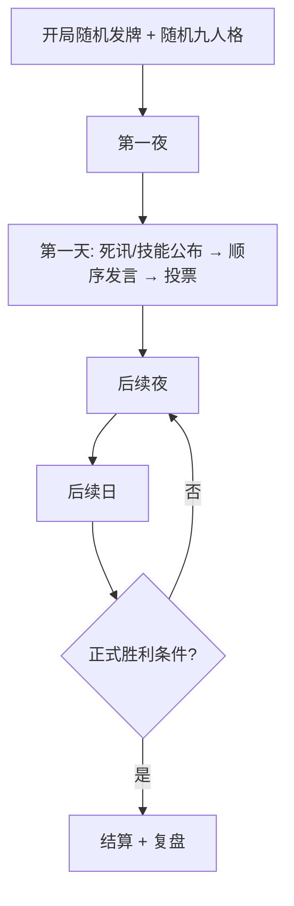

根据你们已对齐的答案，下面是一份可直接给策划 / 程序 / 内容用的**游戏框架与边界梳理**（偏产品规格，不涉及实现细节）。

---

# 十人狼人杀（1 人 + 9 AI）— 框架与边界

## 1. 产品定位与成功标准

| 维度 | 约定 |
|------|------|
| 核心爽点 | 看 AI 互撕；玩家是局中一员，靠合法信息推理 |
| 节奏 | 中等；目标 **约 30 分钟 / 局** |
| 板子 | 传统 **预女猎守**，**无警长** |
| 发牌 | 开局正常随机，玩家身份随机 |
| 胜负归因 | 输了应怪 **自己判断错**，而非规则或 AI 耍赖 |
| MVP 一句话 | **「打完一局觉得能玩下去」** |
| AI 质量底线 | 9 个里最多 **3 个可偏「傻」**；其余需有基本逻辑与一致性 |

**不在 MVP 的**：语音（仅预留与性格挂钩）、白天插话、警长流、玩家影响狼刀。

---

## 2. 角色与人数（固定 10 人板）

标准配置（与正式局一致）：

- **狼人 ×3**
- **预言家 ×1**
- **女巫 ×1**
- **猎人 ×1**
- **守卫 ×1**
- **村民 ×4**

**胜利条件**：按正式局（屠边 / 屠城等你们采用的正式规则需再写死一条文案，避免和「村规」混用）。

---

## 3. 一局时间结构（30 分钟量级）

顺序发言 + 每 AI 最多约 60s，但可提前结束。粗算：

| 环节 | 估算 |
|------|------|
| 单 AI 发言上限 | 60s → 中文约 **150～350 字**（紧张局偏短 80～150 字） |
| 白天一轮 10 人发言 | 上限约 10 分钟；实际若平均 25～35s，约 **4～6 分钟** |
| 夜晚（多角色轮动 + 后台私聊） | 每夜约 **1～2 分钟**（视 LLM 延迟） |
| 投票 / 公布 / 技能结算 | 每轮约 **1～2 分钟** |

**局数预期**：30 分钟内大约 **2～3 个完整「夜—日」循环** 较合理；若经常拖到 4 日以上，需缩短默认发言或提高 AI「说重点」倾向。

**信息密度（产品约束，非精确字数）**：

- 每段发言应对齐：**当前策略 + 逻辑链里的 1～2 个结论**；
- 禁止无目的废话式撒谎（见 §7）。

---

## 4. 对局流程（阶段框架）



### 4.1 夜晚（轮动、私域）

原则：**所有神/狼私域操作不进公屏**；公屏仅系统允许的「天亮可公开」信息（死讯、放逐、明跳内容等按规则）。

| 行动方 | 行为 | 公屏 | 备注 |
|--------|------|------|------|
| 狼人 ×3 | 各自提名刀口 → **票选** → 平票 **随机** | 不展示过程 | **玩家若是狼：其选择不计入狼队票**；仅 2 个 AI 狼票决定 |
| 预言家 | 验人（玩家则后台对话） | 不展示 | AI 预言家后台完成 |
| 女巫 | 救/毒（按规则次数） | 仅结果按规则可见 | |
| 守卫 | 守护 | 不展示 | |
| 猎人/村民 | 通常无夜行动 | — | |

**边界**：夜晚 LLM 对话 = **私域频道**；复盘/死后才可见完整夜聊与 AI 链。

### 4.2 白天（顺序、无插话）

1. 公布夜间结果（及规则下的技能信息）  
2. **严格轮动发言**（每人一轮；**玩家仅在自己回合可输入**）  
3. 投票放逐（正式规则：票型、平票、连锁技能等写进规则表）  
4. 进入下一夜  

**边界**：暂不支持插话、抢麦、公屏自由聊天。

### 4.3 投票 / 验人 / 刀人决策权

- **最终行动由 LLM 在合法信息下做出**（票谁、验谁、刀谁）。  
- **必须先过策略库**：按 **身份** 为最小单元，以 **倾向性** 收窄选项；LLM 在候选策略中选一条再发挥。  
- **强制记忆**：LLM / 系统需维护 **策略使用史 + 公开承诺史**（例如首日出假预言家，之后不可「失忆」）；与逻辑链、发言一致。

---

## 5. AI 认知架构（逻辑边界）

可以拆成四层，职责清晰、避免「开天眼」：

```
┌─────────────────────────────────────────────────┐
│ ① 人格层（每局随机 9 套，性格 > 阵营一致性）      │
├─────────────────────────────────────────────────┤
│ ② 信念 / 逻辑链（仅合法信息，后台持续更新）        │
├─────────────────────────────────────────────────┤
│ ③ 策略库（按身份，倾向性，程序员维护）             │
│    → LLM 选择策略 + 记录已用策略                   │
├─────────────────────────────────────────────────┤
│ ④ 行动 & 发言（刀/验/票 + 公屏发言，可目的性撒谎）│
└─────────────────────────────────────────────────┘
```

### 5.1 人格层

- **每局随机**分配 9 个 AI 性格。  
- **同时影响**：决策倾向（冲票、怂、爱悍跳等）+ **未来语音风格**（当前仅文字，需预留接口）。  
- **与阵营冲突**：**性格优先**（怂狼可以少悍跳，但需在策略层标为「弱狼」行为，避免纯送）。

### 5.2 逻辑链（后台推理）

- 仅基于 **合法信息**（自己身份、已公开发言、票型、死讯、自己验人结果等）。  
- **不对玩家实时展示**；发言时 **按当前逻辑链 + 已选策略** 生成。  
- **玩家死后**：  
  - 可 **明牌式查看全场日志**（含所有 AI 思考）；  
  - 支持 **点选某一 AI 查看其思考链**（单独视图）。  

**边界**：活着的玩家 **不能** 看 AI 内心；避免作弊与剧透。

### 5.3 策略库

| 项 | 约定 |
|----|------|
| 最小单元 | **身份**（狼 / 预 / 女 / 猎 / 守 / 民） |
| 形态 | **倾向性**（权重、优先级），非硬编码 if-else 全覆盖 |
| 维护 | **程序员**（后续可工具化，但不在 MVP） |
| 与 LLM | **LLM 在库中选策略再发挥**；关键行动与发言需能追溯到「选了哪条策略」 |

### 5.4 撒谎规则

- **允许**发言与内心信念不一致。  
- **必须有目的**：悍跳、炸身份、污人、垫飞等 **战术撒谎**。  
- **禁止**：无策略支撑的日常胡说（浪费 60s、破坏「能玩下去」体验）。

### 5.5 状态记忆（必做，否则第二版不用谈）

建议产品层强制记录（供 LLM 与复盘）：

- 已执行策略 ID + 回合  
- 公开身份声明 / 站边 / 验人报验（真假分开存）  
- 投票历史、刀口历史  
- 性格参数快照（本局不变）

---

## 6. 玩家边界

| 能力 | 状态 |
|------|------|
| 随机身份参与全流程 | ✅ |
| 自己回合发言 | ✅ |
| 夜晚私域操作（若神/狼） | ✅，后台不进公屏 |
| 狼人夜晚刀口 | ❌ **不影响** AI 狼队票选结果 |
| 白天插话 | ❌ |
| 语音 | ❌（先文字；与性格绑定的语音为后续） |
| 存活时看 AI 思考链 | ❌ |
| 死后全场日志 + 单 AI 思考链 | ✅ |
| 局后复盘 | ✅ |

---

## 7. 信息可见性矩阵（保密边界）

| 信息类型 | 存活玩家 | 死后玩家 | 局后复盘 |
|----------|----------|----------|----------|
| 公屏发言 / 票型 / 死讯 | ✅ | ✅ | ✅ |
| 自己夜晚私聊 | ✅ | ✅ | ✅ |
| 他人夜晚私聊 | ❌ | ✅（明牌日志） | ✅ |
| AI 逻辑链 / 策略选择 | ❌ | ✅（含单 AI 钻取） | ✅ |
| 真实身份（未出局） | 仅知自己 | 全明 | 全明 |

---

## 8. 内容与技术模块清单（便于拆任务）

| 模块 | 职责 | MVP |
|------|------|-----|
| 规则引擎 | 阶段、技能、胜负、票型平票 | 必做 |
| 发牌 & 座位 | 10 人随机 | 必做 |
| 人格系统 | 9 套随机 + 决策/文风参数 | 必做 |
| 私域频道 | 夜、预言家对话等 | 必做 |
| 狼队票选 | 2 AI 票 + 平票随机；忽略玩家狼刀 | 必做 |
| 策略库 | 按身份倾向性 + 使用记录 | 必做 |
| 信念/逻辑链服务 | 合法信息推理 | 必做 |
| LLM 编排 | 选策略 → 行动 → 发言 | 必做 |
| 公屏发言调度 | 顺序 60s 上限 | 必做 |
| 复盘 & 死后观战 UI | 全场 + 单 AI 链 | 必做 |
| 语音合成 | 性格驱动 | **不做**（预留） |
| 插话 / 警长 | — | **不做** |

---

## 9. 明确非目标（v1 边界外）

- 警长、警徽流、插话、公屏自由聊  
- 玩家狼刀权重、改狼队共识  
- 存活偷看 AI 思考  
- 无目的撒谎、开天眼推理  
- 玩家/community 维护策略库  
- 语音实装（仅架构预留）  
- AI 全员高智商（允许 3 个「陪跑感」）

---

## 10. 主要风险与验收建议

| 风险 | 缓解方向 |
|------|----------|
| 30 分钟打不完 | 默认缩短 AI 发言；策略倾向「控时长」 |
| LLM 遗忘假跳 | 策略使用史 + 公开承诺表强制注入 prompt |
| 性格 > 阵营导致狼太弱 | 策略库为「怂狼」单独给可赢倾向，不是纯摆烂 |
| 复盘信息爆炸 | 分「时间线 / 单玩家 / 单 AI 思考链」三级 |
| 3 个「傻 AI」拉垮体验 | 傻在「风格」而非「违反合法信息或乱撒谎」 |

**建议验收用例（产品侧）**：

1. 玩家拿村民完整打完 30 分钟左右 → 主观「能玩下去」  
2. 玩家拿预言家：夜聊仅私域，公屏无泄露  
3. 玩家拿狼：刀口与 AI 狼票一致，玩家选错不影响结果  
4. 死后能查到：某 AI 第 N 天选了哪条策略、为何票某人  
5. 存在悍跳局：AI 撒谎可追溯到策略目的，且无「下轮忘记跳预」  

---

## 11. 仍建议写死的一条（避免实现分歧）

你们已说「正式局」，但还需 **一页纸规则附录** 定稿：

- 屠边还是屠城  
- 女巫首夜自救、毒药次数  
- 守卫同守同救判定  
- 猎人开枪时机  
- 放逐平票处理  

这些不影响框架，但会影响规则引擎与策略库条目数量。

---

以上是当前需求的**整体框架 + 系统边界**。若你们愿意下一步继续（仍可在 Ask 模式），我可以按该框架输出：**单局状态机表（夜/日子状态）** 或 **策略库目录草案（按 6 身份各 5～10 条倾向）**，方便直接开工。